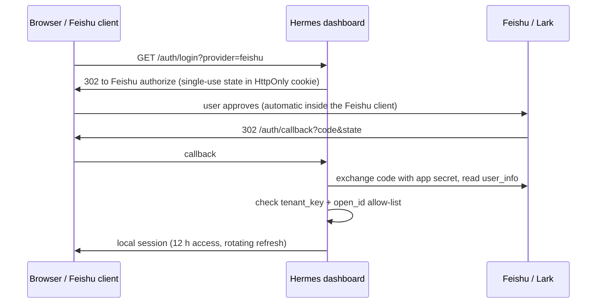

# Feishu / Lark sign-in for the Hermes dashboard

[](https://github.com/xielevi/hermes-dashboard-auth-feishu/actions/workflows/ci.yml)
[](LICENSE)
[](https://hermes-agent.nousresearch.com/docs/)

English · [简体中文](README.zh-CN.md)

A [Hermes Agent](https://github.com/NousResearch/hermes-agent) plugin that puts Feishu (飞书) or Lark
OAuth in front of the web dashboard. You expose the dashboard on a public hostname, and only the
people you list by `open_id` can get in. Inside the Feishu app it can also act as a one-tap
workbench entry.

It is a dashboard auth provider registered through `ctx.register_dashboard_auth_provider()`.
Cookies, auth routes, WebSocket tickets and the login page all belong to Hermes core; this plugin
only answers "who is this, and are they allowed?".

> [!IMPORTANT]
> Everyone on the allow-list gets **full dashboard access**: config, keys, sessions, terminal.
> This is an owner/admin gate, not per-user or per-profile authorization. List only people you
> would hand your Hermes host to.

## How it works



Feishu is contacted once per sign-in. After that the dashboard runs on locally signed session
tokens, and no Feishu token is kept.

## Requirements

- Hermes Agent 0.21.5 or later.
- A Feishu or Lark custom app (企业自建应用) in your tenant.
- HTTPS in front of the dashboard (reverse proxy or tunnel) that keeps the public `Host` header
  and passes WebSockets.

## Install

```sh
hermes plugins install xielevi/hermes-dashboard-auth-feishu --no-enable
hermes plugins enable dashboard-auth-feishu
```

Once the plugin is accepted into the [plugin catalog](https://hermes-agent.nousresearch.com/docs/user-guide/features/plugin-catalog),
`hermes plugins install dashboard-auth-feishu` installs the reviewed commit instead.

## Configure

### 1. Feishu / Lark app

In the [Feishu developer console](https://open.feishu.cn/app) (or [Lark](https://open.larksuite.com/app)):

1. Create a custom app and note its **App ID** and **App Secret**.
2. Under **Security settings → Redirect URLs**, add `https://hermes.example.com/auth/callback`.
3. Optional, for a workbench icon: enable **Web app** and set both desktop and mobile homepage to
   `https://hermes.example.com/auth/login?provider=feishu&next=%2F`.
4. Limit the app's availability to the people who should see it, then publish a version.

You also need your **tenant key** and each person's **open_id**. An open_id is issued per app, so
an ID from a different app (your Hermes bot, say) will not match.

### 2. Plugin settings

Non-secret settings live under the plugin's namespace in `config.yaml`:

```sh
hermes config set plugins.entries.dashboard-auth-feishu.settings.app_id cli_xxxxxxxxxxxx
hermes config set plugins.entries.dashboard-auth-feishu.settings.tenant_key your_tenant_key
hermes config set plugins.entries.dashboard-auth-feishu.settings.owner_open_ids '["ou_xxxxxxxx"]'
hermes config set plugins.entries.dashboard-auth-feishu.settings.domain feishu   # or lark
```

Secrets go in `~/.hermes/.env` (or your process manager's secret environment), never in
`config.yaml`:

```dotenv
HERMES_DASHBOARD_FEISHU_APP_SECRET=...
HERMES_DASHBOARD_FEISHU_SESSION_KEY=...   # openssl rand -hex 32
```

If you already run the Feishu gateway with the same app, the plugin falls back to
`FEISHU_APP_SECRET`; a dedicated variable is still the cleaner choice. Without a session key a
random one is generated at startup, and every restart signs everyone out.

### 3. Turn on the gate

Hermes gates the dashboard once it has a non-loopback public URL, even on a loopback bind:

```sh
hermes config set dashboard.public_url https://hermes.example.com
hermes dashboard --host 127.0.0.1 --no-open
```

Point your reverse proxy at it and sign in. The plugin derives the callback from the same public
URL; set `public_url` in the plugin settings only if it has to differ.

#### Keeping Hermes Desktop working on the same machine

`dashboard.public_url` is machine-wide. On a machine where Hermes Desktop talks to a local
dashboard backend, setting it gates that backend too, and Desktop ends up on a web login page. Leave
the global key unset and run a second, public-only dashboard with the URL in its own environment:

```sh
HERMES_DASHBOARD_PUBLIC_URL=https://hermes.example.com \
  hermes dashboard --host 127.0.0.1 --port 9200 --isolated --no-open
```

Point the reverse proxy at that port only, never at the Desktop backend.

### Environment overrides

Every setting can also come from the environment, which wins over `config.yaml`:

| Variable | Setting |
| --- | --- |
| `HERMES_DASHBOARD_FEISHU_APP_ID` | `app_id` |
| `HERMES_DASHBOARD_FEISHU_TENANT_KEY` | `tenant_key` |
| `HERMES_DASHBOARD_FEISHU_OWNER_OPEN_IDS` | `owner_open_ids` (comma or space separated) |
| `HERMES_DASHBOARD_FEISHU_PUBLIC_URL` | `public_url` |
| `HERMES_DASHBOARD_FEISHU_DOMAIN` | `domain` |

Settings are read at startup. Restart the dashboard after changing the allow-list.

## Security notes

What the plugin does, so you can decide whether to trust it:

- **Network**: only the fixed Feishu or Lark authorize, token and `user_info` endpoints, over TLS
  with a 10 s timeout and no redirects. The app secret is sent server-to-server to the token
  endpoint and nowhere else. No telemetry.
- **Credentials read**: `HERMES_DASHBOARD_FEISHU_APP_SECRET`, or `FEISHU_APP_SECRET` as a fallback
  (the Hermes Feishu gateway's own variable), plus `HERMES_DASHBOARD_FEISHU_SESSION_KEY`.
- **Data stored**: `<HERMES_HOME>/plugin-data/dashboard-auth-feishu/session.sqlite3`, mode 0600 on
  POSIX. Per sign-in it holds tenant, open_id, display name, timestamps, a version counter and a
  revocation flag. No Feishu tokens, no passwords.
- **Login state**: random, single-use, bound to the browser's HttpOnly cookie, valid for 5 minutes.
  The callback must match the configured origin.
- **No upstream PKCE**: this is a confidential server-side client. Feishu's v3 token endpoint
  rejected valid S256 challenges in testing, so the plugin relies on the app secret plus the
  cookie-bound state above. That is not equivalent to PKCE; keep the app secret private.
- **Sessions**: HMAC-SHA256-signed tokens referencing a local row. Access tokens last 12 h; a
  session ends after 14 days idle or 30 days total. Refresh rotates the pair, accepts the previous
  pair for 60 s (parallel tabs), and revokes the whole session if an older refresh token is replayed
  after that.
- **Every request** re-checks tenant and allow-list, so removing someone takes effect on restart.
- **Process**: runs in-process with the dashboard's permissions. No shell commands, subprocesses,
  background tasks, config writes or patches to Hermes core.

Limitations:

- Pending logins live in memory: run a **single** dashboard worker.
- Up to 512 pending logins are kept, oldest evicted first. There is no rate limiter; add one at
  the reverse proxy.
- WebSockets opened before logout can stay open. To sign everyone out, rotate
  `HERMES_DASHBOARD_FEISHU_SESSION_KEY` and restart the dashboard (this closes sockets too).
- The plugin adds no CSRF middleware of its own. Use a dedicated hostname rather than sharing a
  site with untrusted sibling apps.
- Feishu has been used end to end in production. Lark uses the same code against its own
  endpoints but has not been tested live.

See [SECURITY.md](SECURITY.md) to report a vulnerability.

## Development

Tests run inside a Hermes checkout's environment:

```sh
cd /path/to/hermes-agent
uv sync
HERMES_HOME=$(mktemp -d) PYTHONPATH=$PWD \
  uv run --with 'pytest>=8,<10' python -m pytest /path/to/hermes-dashboard-auth-feishu/tests -q
uv run python -m hermes_cli.main plugins validate /path/to/hermes-dashboard-auth-feishu --install-deps
```

The suite covers the provider contract, login state, rotation and replay, expiry and real
`PluginManager` discovery in an isolated Hermes home, with Feishu responses simulated. CI runs the
same checks against a pinned Hermes release.

## License

[MIT](LICENSE)
