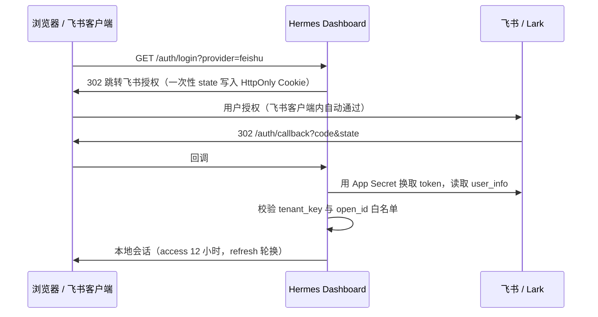

# Hermes Dashboard 飞书 / Lark 登录

[](https://github.com/xielevi/hermes-dashboard-auth-feishu/actions/workflows/ci.yml)
[](LICENSE)
[](https://hermes-agent.nousresearch.com/docs/)

[English](README.md) · 简体中文

给 [Hermes Agent](https://github.com/NousResearch/hermes-agent) 的网页 Dashboard 加一道飞书（或 Lark）
登录。Dashboard 放到公网域名上之后，只有你按 `open_id` 列进白名单的人能进；在飞书客户端里还能做成
工作台应用，点开即登录。

插件通过 `ctx.register_dashboard_auth_provider()` 注册为 Dashboard 认证提供方。Cookie、认证路由、
WebSocket 票据和登录页都由 Hermes 核心负责，插件只回答两个问题：这是谁？放不放行？

> [!IMPORTANT]
> 白名单里的每个人都拥有 Dashboard 的**全部权限**——配置、密钥、会话、终端都能动。这是给机主/管理员的
> 门禁，不是按用户或按 profile 的权限隔离。只把你愿意交出整台 Hermes 的人放进来。

## 工作流程



每次登录只和飞书交互这一轮。之后 Dashboard 用本地签名的会话 token 运转，飞书的 token 一个都不留。

## 环境要求

- Hermes Agent 0.21.5 及以上。
- 一个飞书或 Lark 的企业自建应用。
- Dashboard 前面有 HTTPS（反向代理或隧道均可），需保留公网 `Host` 头并支持 WebSocket。

## 安装

```sh
hermes plugins install xielevi/hermes-dashboard-auth-feishu --no-enable
hermes plugins enable dashboard-auth-feishu
```

插件进入[官方插件目录](https://hermes-agent.nousresearch.com/docs/user-guide/features/plugin-catalog)后，
可以直接 `hermes plugins install dashboard-auth-feishu`，装的是审核过的那个 commit。

## 配置

### 1. 飞书 / Lark 应用

在[飞书开放平台](https://open.feishu.cn/app)（或 [Lark](https://open.larksuite.com/app)）：

1. 创建企业自建应用，记下 **App ID** 和 **App Secret**。
2. 「安全设置 → 重定向 URL」里加上 `https://hermes.example.com/auth/callback`。
3. 想在工作台放个入口的话：启用「网页应用」，桌面端和移动端主页都填
   `https://hermes.example.com/auth/login?provider=feishu&next=%2F`。
4. 应用可用范围只开给该用的人，然后发布版本。

另外还需要租户的 **tenant_key** 和每个人的 **open_id**。open_id 是按应用分配的，别的应用（比如你的
Hermes 机器人）拿到的 open_id 在这里对不上。

### 2. 插件设置

非敏感设置放在 `config.yaml` 的插件命名空间下：

```sh
hermes config set plugins.entries.dashboard-auth-feishu.settings.app_id cli_xxxxxxxxxxxx
hermes config set plugins.entries.dashboard-auth-feishu.settings.tenant_key your_tenant_key
hermes config set plugins.entries.dashboard-auth-feishu.settings.owner_open_ids '["ou_xxxxxxxx"]'
hermes config set plugins.entries.dashboard-auth-feishu.settings.domain feishu   # 国际版填 lark
```

密钥只放 `~/.hermes/.env`（或进程管理器的密钥环境变量），不要写进 `config.yaml`：

```dotenv
HERMES_DASHBOARD_FEISHU_APP_SECRET=...
HERMES_DASHBOARD_FEISHU_SESSION_KEY=...   # openssl rand -hex 32
```

如果 Hermes 的飞书网关用的就是同一个应用，插件会退而读取 `FEISHU_APP_SECRET`；单独配一个变量更清楚。
不配 session key 时每次启动会随机生成一个，重启一次所有人都得重新登录。

### 3. 打开门禁

只要配置了非 loopback 的公网地址，Hermes 就会给 Dashboard 加上认证，即使它只监听在 127.0.0.1：

```sh
hermes config set dashboard.public_url https://hermes.example.com
hermes dashboard --host 127.0.0.1 --no-open
```

反向代理指过去，登录即可。插件的回调地址也取自这个公网地址；只有两者必须不同时，才需要在插件设置里
单独填 `public_url`。

#### 同一台机器上还在用 Hermes Desktop

`dashboard.public_url` 是整台机器生效的。如果 Hermes Desktop 依赖本机的 Dashboard 后端，设了它，那个后端
也会被门禁拦住，Desktop 会被弹到网页登录页。正确做法是不设全局键，另起一个只对外的 Dashboard，把地址放进
它自己的环境变量：

```sh
HERMES_DASHBOARD_PUBLIC_URL=https://hermes.example.com \
  hermes dashboard --host 127.0.0.1 --port 9200 --isolated --no-open
```

反向代理只指向这个端口，不要指向 Desktop 用的后端。

### 环境变量覆盖

每项设置都可以改用环境变量，优先级高于 `config.yaml`：

| 变量 | 对应设置 |
| --- | --- |
| `HERMES_DASHBOARD_FEISHU_APP_ID` | `app_id` |
| `HERMES_DASHBOARD_FEISHU_TENANT_KEY` | `tenant_key` |
| `HERMES_DASHBOARD_FEISHU_OWNER_OPEN_IDS` | `owner_open_ids`（逗号或空格分隔） |
| `HERMES_DASHBOARD_FEISHU_PUBLIC_URL` | `public_url` |
| `HERMES_DASHBOARD_FEISHU_DOMAIN` | `domain` |

设置在启动时读取，改了白名单要重启 Dashboard。

## 安全说明

插件具体做了什么，供你判断是否信任它：

- **网络**：只访问固定的飞书或 Lark 授权、token、`user_info` 三个端点，走 TLS，超时 10 秒，不跟随跳转。
  App Secret 只在服务端发给 token 端点。没有任何遥测。
- **读取的凭据**：`HERMES_DASHBOARD_FEISHU_APP_SECRET`，或回退读取 `FEISHU_APP_SECRET`（Hermes 飞书网关自己的
  变量），以及 `HERMES_DASHBOARD_FEISHU_SESSION_KEY`。
- **落盘数据**：`<HERMES_HOME>/plugin-data/dashboard-auth-feishu/session.sqlite3`，POSIX 下权限 0600。每次登录
  记录 tenant、open_id、显示名、时间戳、版本号和吊销标记；不存飞书 token，也没有密码。
- **登录 state**：随机、一次性、绑定浏览器的 HttpOnly Cookie，5 分钟有效；回调地址必须与配置的 origin 一致。
- **不向上游使用 PKCE**：这是服务端机密客户端。实测飞书 v3 token 端点会拒绝合法的 S256 challenge，所以插件
  依靠 App Secret 加上面那个绑定 Cookie 的 state。这和 PKCE 并不等价，App Secret 务必保管好。
- **会话**：HMAC-SHA256 签名的 token，指向本地一行记录。access token 有效 12 小时；闲置 14 天或累计 30 天后
  会话结束。refresh 会轮换整对 token，前一对在 60 秒内仍可用（多标签页并发刷新），超时后若有人重放旧的
  refresh token，整个会话直接吊销。
- **每次请求**都重新校验 tenant 和白名单，从白名单移除某人后重启即生效。
- **进程**：以 Dashboard 的权限在进程内运行。不执行 shell 命令，不起子进程或后台任务，不写配置，不改 Hermes 核心。

已知限制：

- 待完成的登录保存在内存里，Dashboard 只能跑**单个** worker。
- 最多保留 512 个待完成登录，满了淘汰最早的。插件不做限流，请在反向代理上加。
- 登出前已经建立的 WebSocket 可能不会断开。要让所有人下线，轮换 `HERMES_DASHBOARD_FEISHU_SESSION_KEY` 并重启
  Dashboard（重启也会断开连接）。
- 插件本身不加 CSRF 中间件。请给 Dashboard 用独立的域名，不要和不可信的兄弟站点共用。
- 飞书已在生产环境完整跑通。Lark 走同一套代码、换用它自己的端点，但还没有实测。

漏洞报告方式见 [SECURITY.md](SECURITY.md)。

## 开发

测试需要在 Hermes 源码目录的环境里跑：

```sh
cd /path/to/hermes-agent
uv sync
HERMES_HOME=$(mktemp -d) PYTHONPATH=$PWD \
  uv run --with 'pytest>=8,<10' python -m pytest /path/to/hermes-dashboard-auth-feishu/tests -q
uv run python -m hermes_cli.main plugins validate /path/to/hermes-dashboard-auth-feishu --install-deps
```

测试覆盖认证提供方协议、登录 state、轮换与重放、过期，以及在隔离的 Hermes home 里走真实 `PluginManager`
的加载注册；飞书的响应是模拟的。CI 针对固定版本的 Hermes 跑同样的检查。

## 许可证

[MIT](LICENSE)
